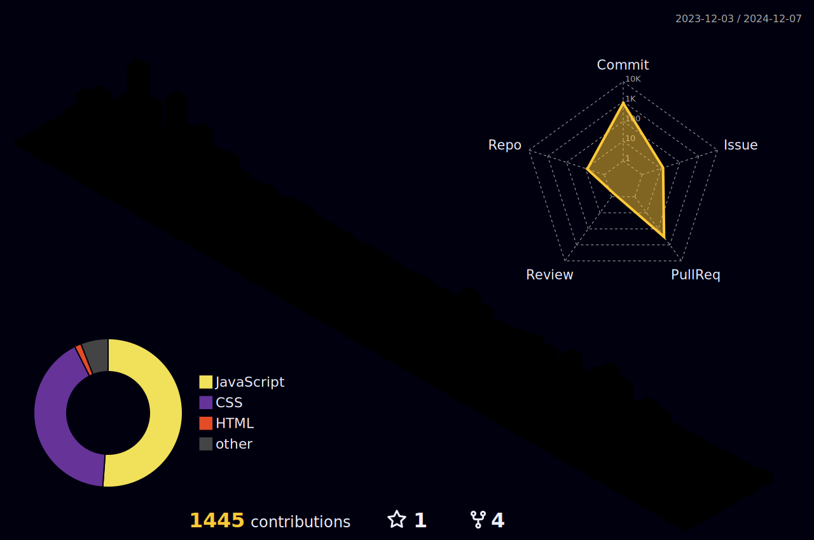

<!--  

  

###

 <a href='https://www.linkedin.com/in/rishabh-pathak-634078250'> 
   <a href='https://www.youtube.com/@rishabhog9909/featured'>  
 <a href="https://www.instagram.com/rishbaskarabh_359/"> 

 
-->
###

###

<h1 align="center">Hello there!👋Myself Rishabh Pathak</h1>

###

<h3 align="left">👩‍💻  About Me</h3>

###

<a href="https://telegra.ph/Oh-youre-here-I-have-something-to-say-yet-again-05-19-2" target="_blank"><strong>Something To Say →</strong></a>

###
## 📧 You can contact me on:

_I am open to new opportunities/contributions._

## 🔎 You can find me on:

 <a href="https://www.instagram.com/rishbaskarabh_359/"> 

  
###
<h3 align="left">🛠 Language and tools</h3>

###

<!-- 

  
  
  
  
  
  
  
  
  
  
  
  
  
  
  
  
  
  
  
  
  
  
  
  
  

 -->

  

###

<!--
<h3 align="left">🔥   My Stats :</h3>

###

 

  

 -->

###

## Thanks for visiting

 

Counting of visitors to this page in this section started from Nov 9, 2024

### 📈 GitHub Activity Graph:

<!-- Green snake graph -->

<!-- Stats and languages -->
| .                                                                                                                                                          | .                                                                                                                                            |
| ---------------------------------------------------------------------------------------------------------------------------------------------------------- | -------------------------------------------------------------------------------------------------------------------------------------------- |
|  |  |

<!-- Streak stats -->
</img>

<!-- Dark snake graph -->

<!-- Profile animation (green) -->

Trophy: Github Profile Trophy

 

###
